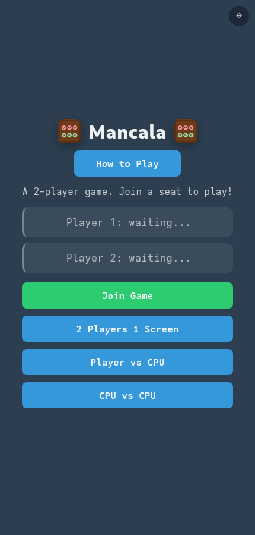
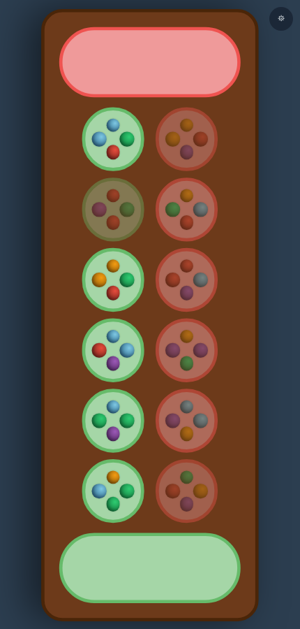
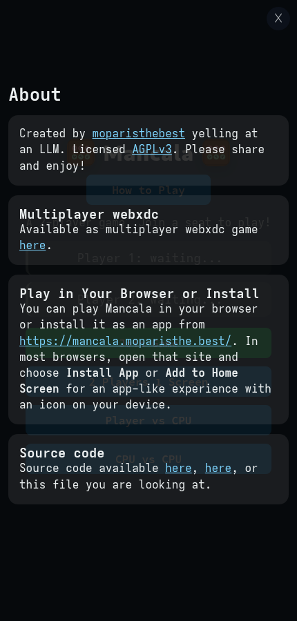
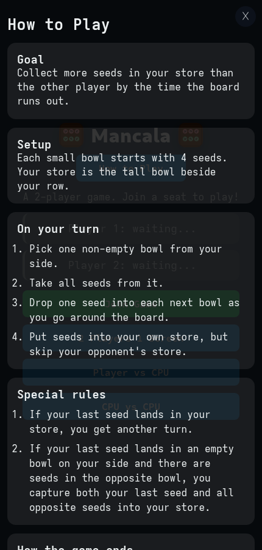

# Mancala

Mancala is a polished Kalah-style Mancala game that works in multiple ways:

- as a real-time multiplayer [webxdc](https://webxdc.org/) app
- as a local **2 Players 1 Screen** game
- as **Player vs CPU** and **CPU vs CPU**
- as a plain browser app you can also install as a **PWA**

Created by [moparisthebest](https://moparisthebest.com) yelling at an LLM. Licensed [AGPLv3](https://www.gnu.org/licenses/agpl-3.0.html). Please share and enjoy!

## Play It

- **Play in your browser or install it:** <https://mancala.moparisthe.best/>
- **Download the multiplayer webxdc package:** <https://mancala.moparisthe.best/mancala.xdc>
- **Source code:** [code.moparisthe.best](https://code.moparisthe.best/moparisthebest/mancala), [GitHub](https://github.com/moparisthebest/mancala), or this checkout

## Screenshots

| Landing screen | Board example |
| --- | --- |
|  |  |

| About screen | How to Play screen |
| --- | --- |
|  |  |

## Ways to Play

### Multiplayer webxdc

Open the `.xdc` file in [Cheogram](https://f-droid.org/en/packages/com.cheogram.android/) or [Delta Chat](https://f-droid.org/en/packages/com.b44t.messenger/) and have two players join the same game. The app syncs moves, turns, scores, seeded marble colors, winner state, and quit/new-game flow across players.

### Local: 2 Players 1 Screen

Start a completely local game on one device with Red on top and Green on bottom.

### Local: Player vs CPU

Choose a CPU opponent, then choose who goes first. The human always stays on the bottom row.

### Local: CPU vs CPU

Choose a CPU for each side and let them play the full game locally.

### Plain web / PWA

If `webxdc.js` is unavailable, the app automatically switches to local-only mode:

- **Join Game** is hidden
- hotseat and CPU modes still work
- the app still has its favicon
- it can still be installed as a PWA

## Rules

### Goal

Collect more seeds in your store than the other player by the end of the game.

### Setup

Each small bowl starts with 4 seeds. Your store is the tall bowl beside your row.

### On your turn

1. Pick one non-empty bowl from your side.
2. Take all seeds from it.
3. Drop one seed into each next bowl as you go around the board.
4. Put seeds into your own store, but skip your opponent's store.

### Special rules

1. If your last seed lands in your store, you get another turn.
2. If your last seed lands in an empty bowl on your side and there are seeds in the opposite bowl, you capture both your last seed and all opposite seeds into your store.

### End of game

When one side has no seeds left in its small bowls, the game ends. All remaining seeds on the other side go into that player's store. The higher store total wins.

## CPU Players

Available local CPU players are declared near the top of `index.html` and are easy to extend.

- **Bob** — always moves the bowl closest to his store
- **Bill** — always moves the bowl furthest from his store
- **Charlie** — picks a random legal bowl
- **Jan** — prefers moves that earn another turn, then falls back to closest-to-store
- **Jill** — prefers moves that earn another turn, then falls back to furthest-from-store
- **Thomas** — prefers another turn first, then randomly falls back among multiple chooser strategies
- **Ashton** — optional Rust/WASM lookahead player that searches as deep as possible for up to 1000ms per turn; she is only shown when `mancala-solver.wasm` loads successfully

## UI Notes

- The landing page has a clear **Mancala** title plus a top-level **How to Play** button.
- Clicking either score store toggles between **marbles** and **numbers**.
- The gear / close button works on the landing page as well as in-game.
- The menu includes **How to Play** and **About** views.
- The About screen links to the author site, AGPL license, browser/PWA page, webxdc package, and source repositories.

## Development

### Prerequisites

- `zip` command (for building the `.xdc` package)
- optional - Node.js - for testing only
- optional - Rust with the `wasm32-unknown-unknown` target - for building `mancala-solver.wasm`

### Install dependencies

```sh
npm install
```

To install the Rust WASM target:

```sh
rustup target add wasm32-unknown-unknown
```

### Run the dev server

```sh
bash start-server.sh [IP] [PORT] [--no-webxdc] [--no-wasm]
```

### Rebuild the Rust/WASM solver

```sh
./mancala-solver/build.sh
```

Examples:

```sh
bash start-server.sh
bash start-server.sh 192.168.1.5
bash start-server.sh - 8080
bash start-server.sh 192.168.1.5 8080
bash start-server.sh --no-webxdc
bash start-server.sh - 3000 --no-webxdc
bash start-server.sh --no-wasm
bash start-server.sh - 3000 --no-webxdc --no-wasm
```

`--no-webxdc` makes `/webxdc.js` return 404 so you can test the plain-web local/PWA fallback.
`--no-wasm` makes `*.wasm` return 404 so you can test optional solver fallback.

With normal browser testing, the included `webxdc.js` stub uses `localStorage` and `storage` events to simulate multiple devices in separate tabs.

Example second-player URL:

```text
http://127.0.0.1:3000/index.html#name=device1&addr=device1@local.host
```

### Run tests

```sh
npm test
```

The Puppeteer suite covers:

- webxdc join flow and synchronized gameplay
- hotseat mode
- full deterministic hotseat playthroughs with animations off and on
- menu, How to Play, and About flows
- local CPU setup and autoplay
- duplicate-name labeling
- plain-web fallback without `webxdc.js`
- favicon / manifest / service worker PWA behavior

### Build the `.xdc` package

```sh
bash create-xdc.sh
```

This creates `mancala.xdc`, a zip file containing the app for Delta Chat webxdc play. `webxdc.js` is intentionally excluded from the package because the real webxdc runtime supplies it.

### Refresh board screenshots

```sh
bash screenshots/screenshot.sh
```

### Refresh README screenshots

```sh
bash screenshots/readme-screenshots.sh
```

## Project Structure

```text
index.html               Main app (HTML, CSS, JS)
webxdc.js                Browser webxdc stub for development/testing
test.js                  Puppeteer regression suite
manifest.toml            webxdc manifest
manifest.webmanifest     plain-web/PWA manifest
pwa-sw.js                plain-web service worker
icon.png                 source app icon
icon-192.png             PWA icon
icon-512.png             PWA icon
create-xdc.sh            build script for mancala.xdc
start-server.sh          local dev server
rewrite-history.sh       history rewrite helper script
screenshots/             README and board screenshots
```

## License

This project is licensed under the [GNU Affero General Public License v3.0](LICENSE.md).
